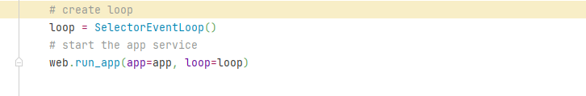

# 系统

## 功能结构

### 1. 基本系统

1. 系统功能
   1. 注册完成
   2. 登录完成
   3. 注销完成
2. 智能识别
   1. 目标检测
      1. 加载模型保持在系统中。
      2. 路径写入配置文件system.yaml
      3. 正在完成init_models，加载模型方法。
         1. 获取模型路径，将路径记载并返回，完成。
         2. 正在尝试加载网络模型。模型加载已经解决。
         3. 加载类型解决
      4. 尝试完成图片传输
         1. 完成
      5. 整理模型与图像传输接口，完成。

## bug

1. 事务循环，python3.7及更高版本（可能>3.7？），对asyncio来说ProactorEventLoop不支持add_write与add_reader，这使得可能存在数据库引擎或者其他aio库调用add_write或者add_reader报错的情况。如果没有发现是什么问题的话，最好的办法是创建一个新的事务循环，并加入到runapp中。如图所示
2. 登录验证，目前问题锁定在查询，这里有一个问题，我发现方法返回的对象是包含了iterate这个字眼的，但是却不可以使用简单的for循环。问题为如下，这里突出的async的重要性，对于异步的对象操作，一定要注意async和await。这里加入async后，便可以完成迭代。
   1. 这里注意<class 'aiopg.sa.result.RowProxy'>对象，是一个字典对象，默认遍历时获取的是它的键值，因此可能会出现如下的情况。这种情况，只需要给返回值后面加上values()调用它的值方法就可以解决。
3. 理解模型部署的过程，在进程池中设置可同时工作的执行器的最大数目，将model加载到每一个进程中，之后加入可并发运行的队列，结束后，需要将close_execute添加到on_cleanup中，处理完成后，将执行器添加到app中。
   1. on_cleanup要包含应用程序清理时要触发的信号。
   2. clean_ctx包含了启动清理上下文的生成器列表。
4. with用法，with后必须要接可上下文管理的对象，否则会报错，无get或无exit的方法。
5. 优先级的问题，await的优先级很低，
6. 跨域问题：
   1. aiohttp默认不支持跨域请求

## note

1. 服务端与客户端传输数据
   1. 获取客户端数据：直接从request中读取json。这里没有前端的代码，我直接以后端去模拟。
2. 信号量处理
   1. signal可以被用来进程间通信和异步处理
      1. 
3. 图像传输
   1. 利用opencv/PIL等方式，存在比较高的延迟，已实现
   2. 利用base64，无法传送很大的文件，已实现
   3. 直接二进制传送，最佳方案，已实现。