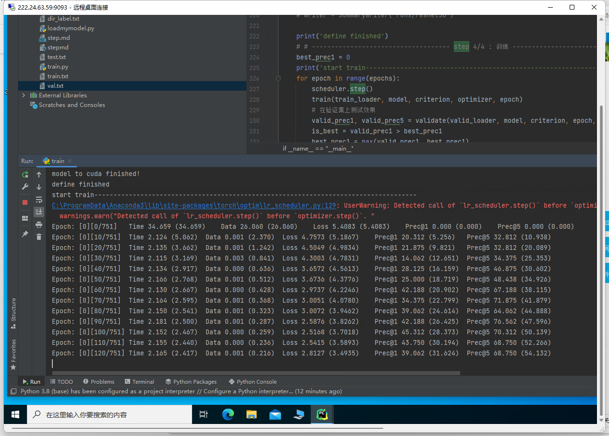

## 垃圾分类小程序

### 基本配置

算力服务器：
GPU云主机已开好，远程桌面地址为222.24.63.59:9093
管理员账号：xuptcs 
初始密码：wy2021/7/20

1. 版本: v1.5
2. 后端：更新中
   1. g：修改后台服务器A后端接受数据接受改为json格式，服务改为异步运行，将接口暴露给h
   2. l：完成aiohttp异步框架，将算法载入到后台服务器B并将接口暴露给g或者h
3. 前端：更新中
   1. 将算法接口暴露的数据渲染。
4. 算法：更新中
   1. 预处理数据集
      1. 将图像与val值对应
      2. 加载数据：
         1. 这里经过测试，加载数据本身就需要较长的时间，这里太浪费时间了。
   2. 进行网络结构搭建
      1. 先利用models.resnext101()直接测试，
         1. 这里出现问题，需要对官方库做一定的修改，加载自己的模型
         2. 查看load_state_dict_from_url()方法
         3. 这里注意模型训练期间是不能使用with no grad的，因为训练的过程就是依赖于grad的，如果训练期间使用with no grad那么，这个训练会报错，我们假设可以训练，这次训练也不会任何的效果。
         4. correct[:k].contiguous().view(-1).float().sum(0, keepdim=True)，这里view需要tensor中的元素地址是连续的，如果不连续的话会报错
         5. 到这里bug就已经差不多了。
   3. 利用算力服务器进行训练
      1. 这边正打算把模型扔到服务器上。
      2. 模型已经开始训练 
         1. 2022/6/6 loss: 0.07
      3. 获取模型，测试推理服务
      4. 测试完成，获取模型
   4. 完成自己的推理模块
      1. 对单数据的推理已经完成。
### debug

1. resnext101加载url模型的类，属于models的底层代码，修改url之后会报错应该是由于download的原因
   1. 这里需要读源码做一定的更改，将网络修改为自己的结构，否则后期网络调优无法实现。

   
### 服务器配置

1. 基本配置
   1. 

### 参考资料

1. 网络建议: https://zhuanlan.zhihu.com/p/70757697
2. 推荐教程: https://mp.weixin.qq.com/s/Yt2M-cjLdRgOowNNm2Ll8Q
3. 数据集: 
   1. 官网：https://aistudio.baidu.com/aistudio/datasetdetail/30982
   2. 百度云：链接：https://pan.baidu.com/s/1yWC-rxkXVlCJa0hrAiYEkg 提取码：sg3x