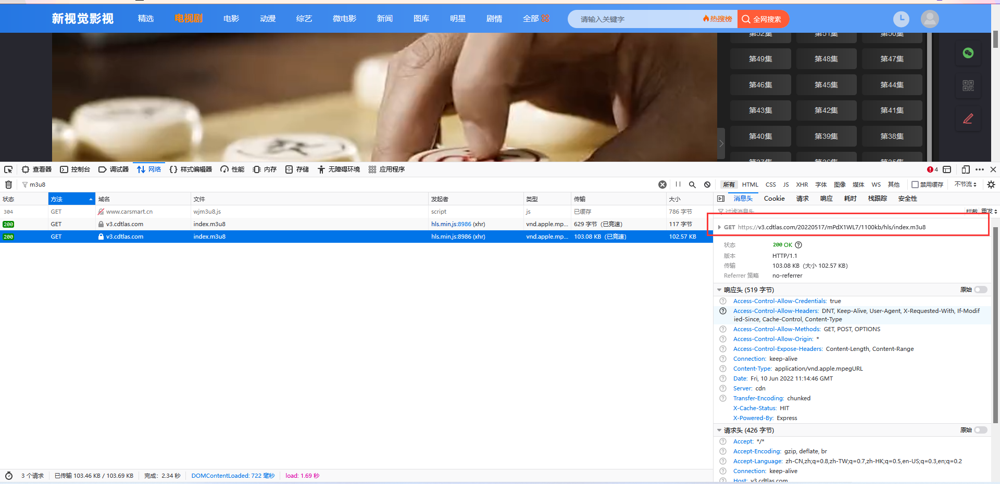
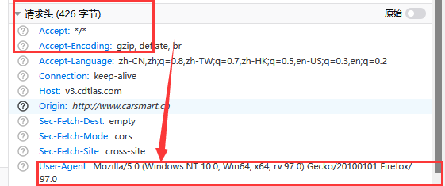

### 线性执行下载m3u8文件脚本

### 理清.m3u8，.ts文件到底是什么

**m3u8文件存在的意义是其实就是为了缓冲，在浏览器观看的视频小的有几百M，大的有几个G，如果浏览器要一次下载
完，我们在观看，显然在当今这个网速不是很现实，因此目前采用的方法是对mp4文件分成一个个的ts文件，这些ts文件
合并就可以拼成一个完整的mp4，同时浏览器端每加载一个ts文件，就将它返回给用户端，这样就实现了缓存播放的功能
。而.m3u8文件存在的目的就是为了存放.ts文件的地址。**

这样理下来，我们在不考虑各种加密的情况下，爬取视频其实就是一件非常轻松的事情。

### 1. 获取m3u8文件

一般而言我们在谷歌或者火狐的控制台可以通过各种响应筛选出我们需要的m3u8文件，例如：
其实如果复制这个链接，直接在浏览器访问，它就会询问我们是否要下载该链接。那么如果这边都是要用脚本去实现的
所以不需要理它。

那么在工作开始之前，我们首先要对自己进行一个基本的身份伪装，让我们化身浏览器。如下图所示:
我们需要偷一个请求头使用，后端是根据我们的请求判断我们是谁的，假设我们是浏览器，那么我们就有足够的理由在短时间内
高速的访问服务端的资源。

**这边说一句题外话。。。线性爬虫开启后，我发现需要很多的时间才可以下载下来整个视频，在这个时间金贵的
时代，显然我们不能就这么线性做下去，因此，我这边直接异步开发shit。**

