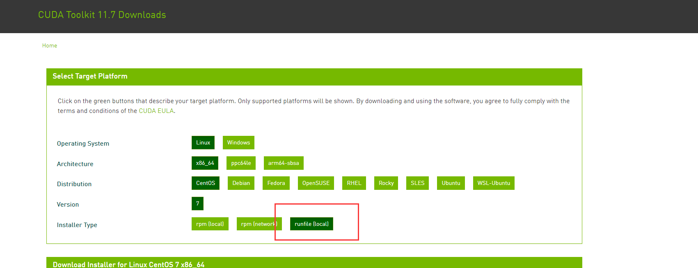
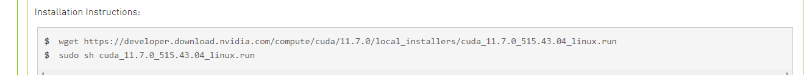
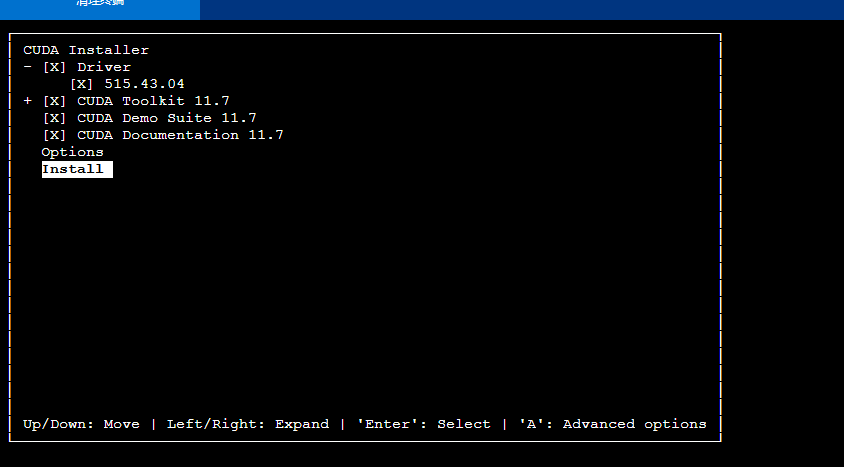
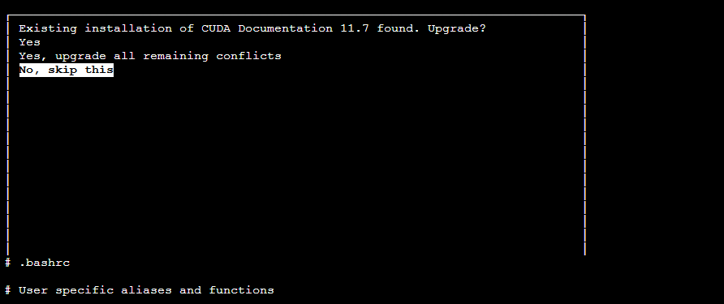
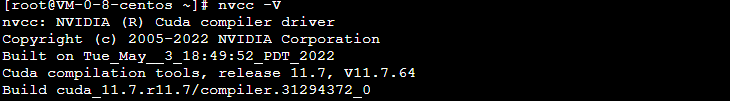
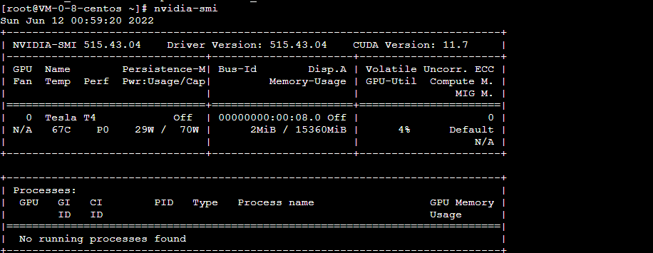
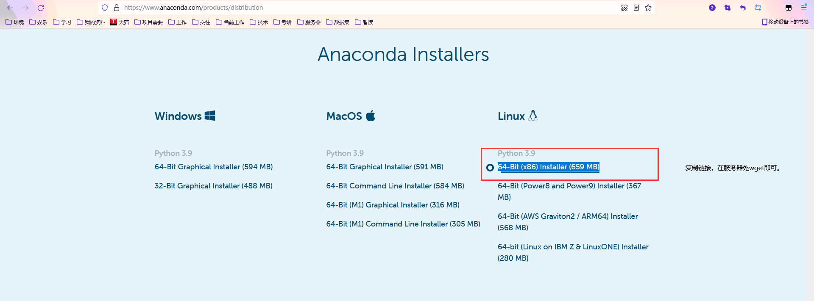

## centos+anconda+pytorchgpu深度学习环境配置

### 1. 安装cuda+安装cudnn

[cuda官网链接](https://developer.nvidia.com/cuda-downloads?target_os=Linux&target_arch=x86_64&Distribution=CentOS&target_version=7&target_type=runfile_local)
下载runfile


这里有指令，运行即可，出现如下：


接下来跟着默认一直走，如果出现要求更新，直接skip即可。


往.bashrc中加入参数
```bash
if ! grep "/usr/local/cuda/bin" ~/.bashrc
then 
  echo                                                                    >> ~/.bashrc
  echo export PATH="\$PATH:/usr/local/cuda/bin"                           >> ~/.bashrc
  echo export CUDA_HOME=/usr/local/cuda                                   >> ~/.bashrc
  echo export LD_LIBRARY_PATH="/usr/local/cuda/lib64:\$LD_LIBRARY_PATH"   >> ~/.bashrc
fi
source ~/.bashrc
```

输入
```bash
nvcc -V
```
验证


输入
```bash
nvidia-smi
```


**如果我们完全按照默认走的话，这里就已经帮我们安装完成了。**


### 2. 安装anconda

[网址](https://www.anaconda.com/products/distribution)

