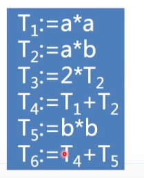
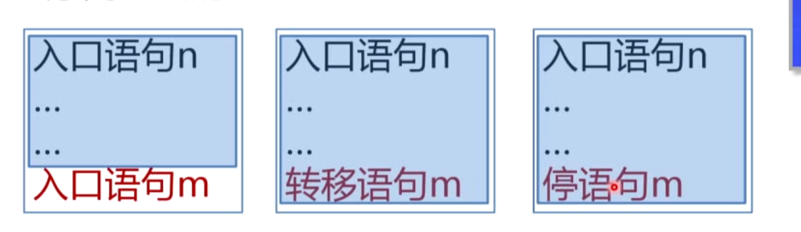
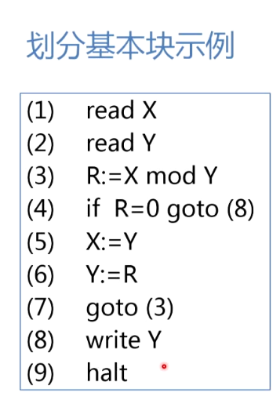
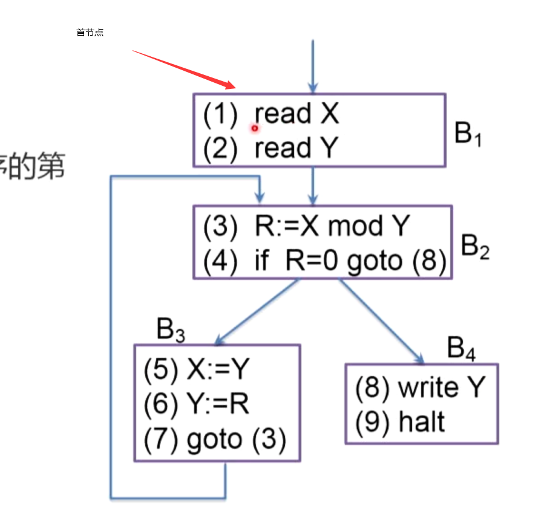
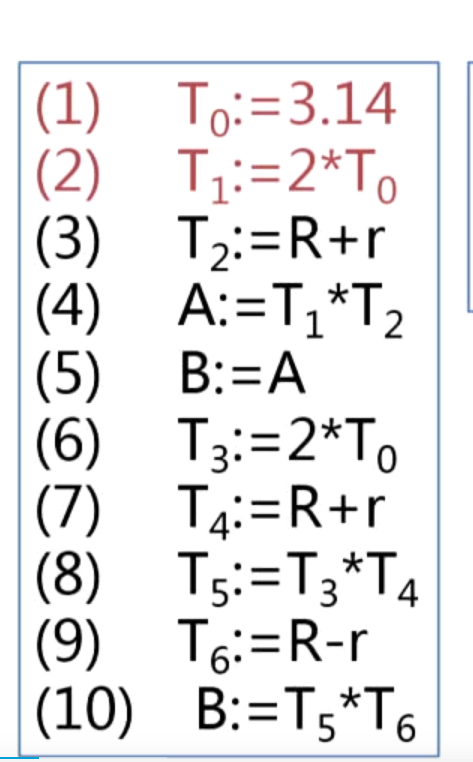

# 优化

## 优化技术

优化技术存在于优化段，它的目的是对程序进行等价变换，使得可以生成更有效的目标代码

优化可于
1. 中间代码
2. 目标代码生成

优化主要包括
    
    1. 控制流分析
    2. 数据流分析
    3. 代码变换

### 优化的目的

产生更高效的代码

### 优化的原则

    1. 等价原则
    2. 有效原则
    3. 合算原则

### 分为三个级别

    1. 局部优化：基本块
    2. 循环优化：在循环范围优化
    3. 全局优化：对整个代码统筹考虑

### 常见的措施

    1. 删除多余运算（删除公用子表达式）
    2. 合并已知量
    3. 复写传播：复写传播可以省去很多的多余计算，比如对同一个变量进行多次计算赋值，例如等价变量的引用
    4. 删除无用赋值
    5. 强度削弱：将加法修改为加减法
    6. 删除归纳变量

### 局部优化
   
**局部优化在基本块的范围内**

基本块：在中间语言程序中顺序执行的语句序列，如图为一个基本块

活跃：某个给定点的活跃的，指的是该名字在基本块或者其他基本块中被引用。

#### 基本块划分算法

目的：找出程序中的基本块(这里的程序指的中间代码语句)

三种语句可能成为基本块的入口：
    
    1. 程序的第一个语句
    2. 能够由转移语句转移到的语句
    3. 紧跟在条件转移以及后面的语句

划分基本块分为三步：
    
    1. 找入口
    2. 找出口
    3. 检查

在找到基本块入口语句后，就可以确定其所属的基本块，如图所示

未纳入基本块中的语句是执行不到的，也就是可以删除的语句。

基本块实例：

### 流图

以基本块为节点，可以表示程序的流图，以表示程序的执行顺序

    1. 首结点
    2. 前驱
    3. 后继

### 构造基本块的DGA

根据如图构建
