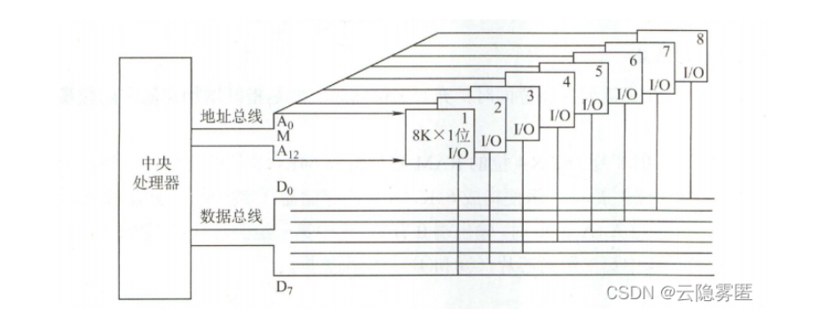
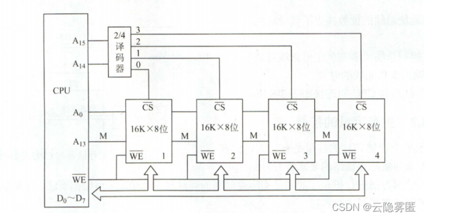
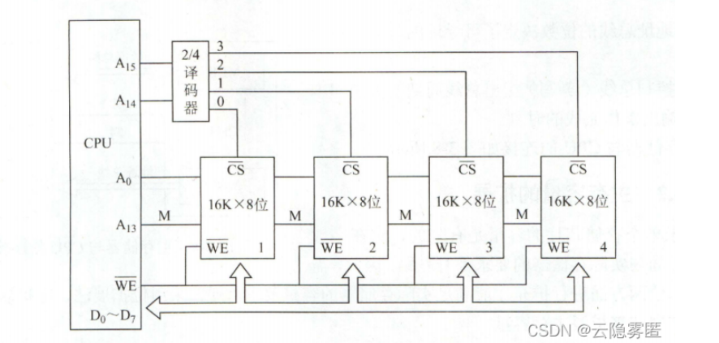
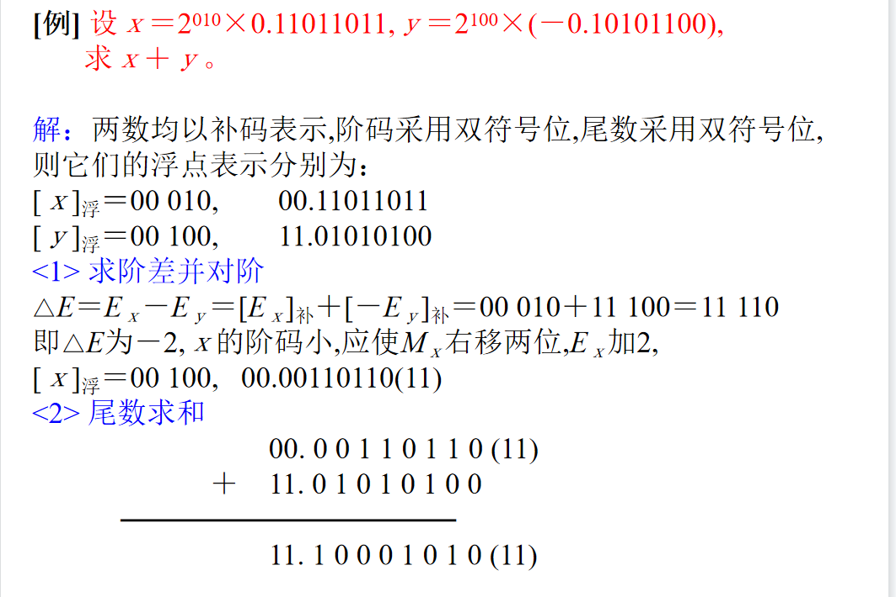
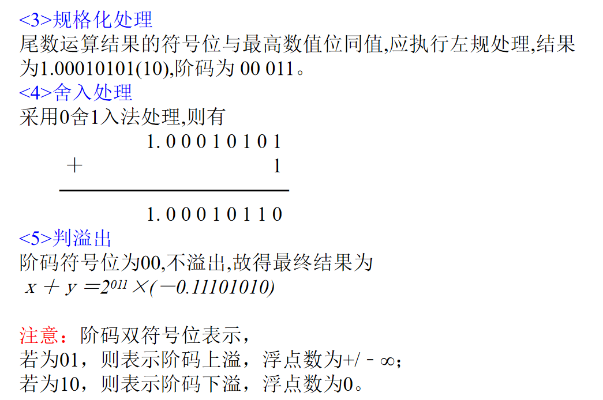
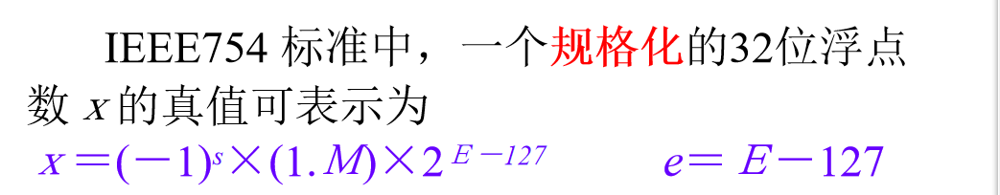
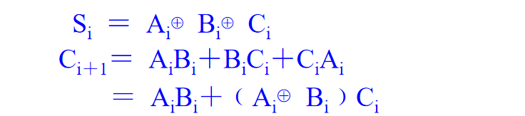

## 计算机组成

####  指令的时空性

指令有存储指令的地方，指令有指令周期，

数据有存储数据的地方，

####  可执行文件的执行过程

1. 取指令，从存储器的某个地址取出指令
2. 分析指令，将指令送到指令译码器获取指令码
3. 执行指令，向各部件发送控制操作
4. 为下次取指令做准备，

### 存储器的扩展

三种方法

1. 字扩展
   1. 例：用16K×8b的SRAM组成以64K×8b的存储器，所需芯片数为：(64K×8b)/(16K×8b)=4(片)。
2. 位扩展
   1. 例：用64K×1b的SRAM芯片组成64K×8b的存储器，所需芯片数为：(64K×8b)/(64K×1b)=8(片)
3. 字位扩展
   1. 例：用l\*k的芯片构成m\*n的存储器，所需芯片数为：(m/l)\*(n\*k)片

绘图：

字扩展：

位扩展：

字位扩展：

### 操作码与地址指令

定长操作码指令是在指令字的最高位部分分配固定的若干位表示操作码，对于具有n位操作码字段的指令系统，最多能够表示2^n条指令。

不定长操作码指令格式就是操作码的长度不固定。操作码的长度随着地址码个数的减少而增加，不同的地址数的指令可以具有不同长度的操作码

零地址指令：只给出操作码，没有显式地址

一地址指令：给出操作码和单操作数指令

### 双符号位补码运算法

例题：

### IEEE754标准

### 全加器表达

### 行波进位加法器的串行和并行

组内并行，组间串行

组内串行，组间并行

### 浮点数计算的步骤

(1). 0操作数的检查
(2). 比较阶码大小并完成对阶
(3). 尾数进行加或减运算
(4). 结果规格化并进行舍入处理(包含判溢出)

### 浮点运算流水线

是在计算机上实现时间并行性的一种非常经济的方法。假定作业 T 被分成 k 个子任务，可表达为 T＝{T1,T2,···,Tk}各个子任务之间有一定的优先关系：若i<j，则必须在 Ti 完成以后，Tj才能开始工作。具有这种线性优先关系的流水线称为线性流水线。

