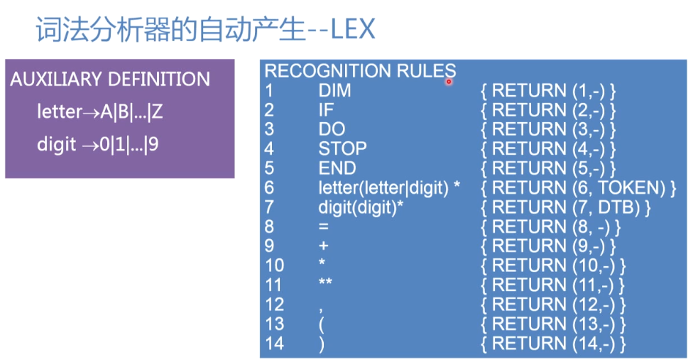

## lex

### 实现词法分析的自动生成

1. 根据正规集，写出各类单词的正规式
2. 根据正规式，构造识别所有单词的NFA
3. 根据NFA，转化为识别所有单词的dfa
4. 将dfa的状态转移函数实现为二维数组并结合程序，就完成了词法分析程序

**lex就是根据如上思想完成的词法分析的自动生成器**

lex包含两部分

    1. 辅助域：定义了一些正规式供我们使用
    2. 规则域：包含多条词法分析规则

lex的工作过程：

    1. 根据每条识别规则 Pi 构造一个NFA Mi
    2. 引入新的初始状态 X ，通过空符将这些 M 连接为一个新的 NFA
    3. 对该NFA确定化为DFA，并对它化简
    4. 该DFA与状态转换表和执行程序绑定就完成了。