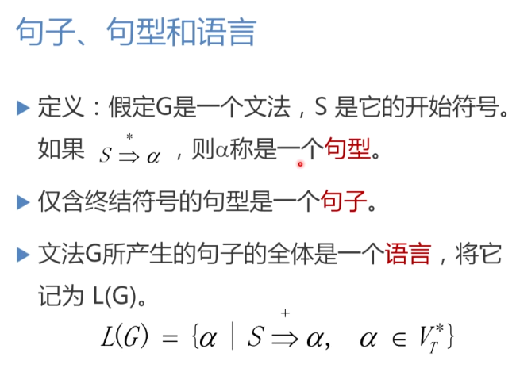
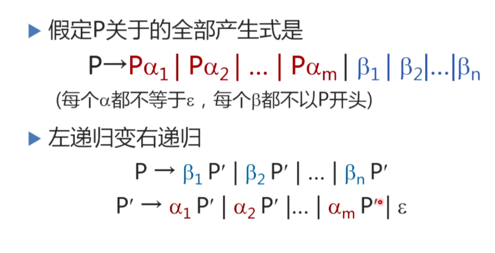

## 语法分析

语法分析器在编译程序中起主导和分析作用

用上下文无关文法描述语言的语法规则

### 上下文无关文法

**直接推出：**

**解析：a替换为γ且上下文不变。**

### 句子，句型，文法

**注意，句子也属于句型，仅包含终结符的句型称为句子**

### 语法分析方法分为两类

#### 自上而下的分析方法

从文法的开始符号出发，向下推导，推出我们需要的句子

从树的根节点出发自上而下的为输入串建立一个语法树

实例如图所示：

**面对的问题如下：**

1. 那么显然当一个非终结符有多个候选式会带来一个复杂的回溯问题。当它用某一个
候选去匹配，结果仅仅是前一半匹配成功，某一点匹配失败了，这时候就需要回溯
到前面的某一个节点

**此时避免回溯是一个自上而下分析需要面对的重要问题。**

2. 还有一个问题，就是文法的左递归的问题，此时不难想到，构造文法树的时候有
可能出现一直扩展的情况，此时单词分析没有前进而语法树无限生长。

我们需要构造不带回溯以及不会陷入无限递归的算法

1. 消除文法的左递归

左递归如下所示：

进行修改得到，实现了消除左递归

消除左递归实例

消除间接左递归

#### 自下而上的分析方法

